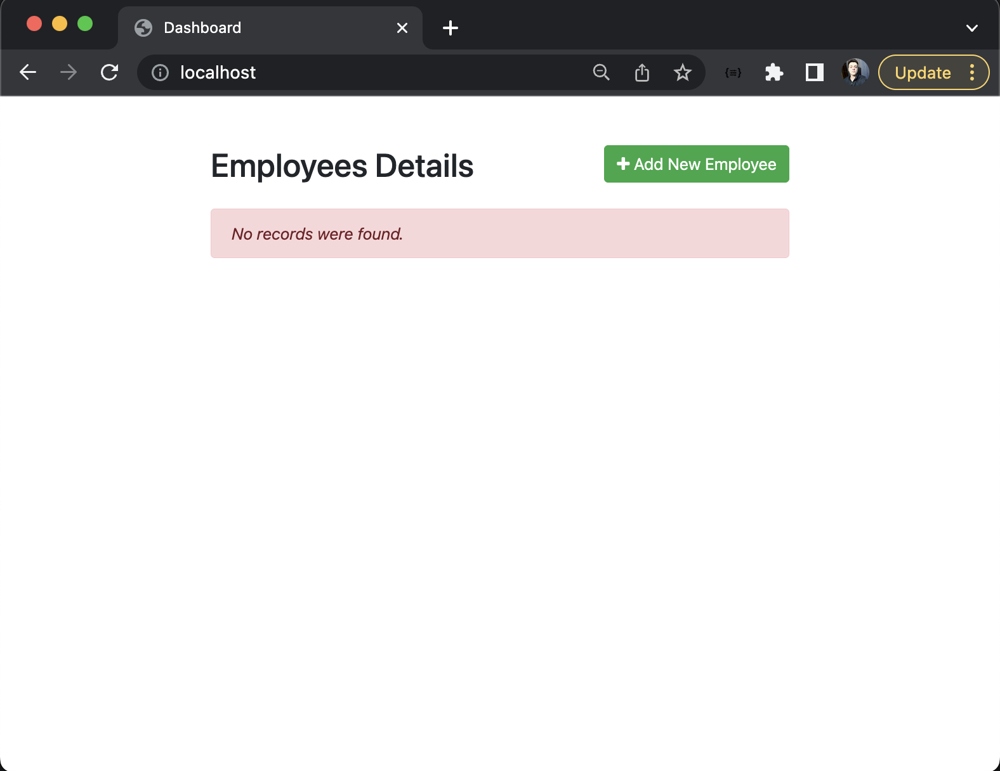

# Rodando aplicação PHP + Apache + Mariadb com Docker e Docker-compose

1 - Primeiro de tudo vamos criar um arquivo docker-compose.yml na raiz do nosso diretorio.

Primeiramente adiconaremos a configuração para executar um container com o mariadb

```
version: "3"
services:
  database:
    image: mariadb
    restart: always
    environment:
      MYSQL_ROOT_PASSWORD: root
      MYSQL_DATABASE: crud
      MYSQL_USER: crud
      MYSQL_PASSWORD: root
    volumes:
      - ./database/db.sql:/docker-entrypoint-initdb.d/db.sql
    ports:
      - 3306:3306
```

version: Define a especficação do docker-compose e para esse exemplo utilizaremos a 3 que é recomendada para a versão 1.29.2

services: Define os serviços que executaremos em container, nesse caso o nosso servidor de banco de dados, mariadb/mysql.

Para o nosso serviço database:
Especificamos a imagem do mariadb, e definimos que sempre ele tiver a execução interrompida por algum motivo, será reiniciado.
Em environment, definimos as variáveis de ambiente para o nosso servidor.
Já nos volumes, mapeamos um arquivo sql para ser executado no momento da incialização do nosso mariadb, com isso podemos ter os comandos ddl executados e assim que ele for inicializado termos o nosso banco de dados pronto para utilização.
E em ports, fazemos o mapeamento da nossa porta 3306 para a porta 3306 do container.


2 - Agora vamos adicionar um service para executar o apache e php

```
version: "3"
services:
  app:
    image: php:7.4-apache
    ports:
      - 80:80

  database:
    image: mariadb
    restart: always
    environment:
      MYSQL_ROOT_PASSWORD: root
      MYSQL_DATABASE: crud
      MYSQL_USER: crud
      MYSQL_PASSWORD: root
    volumes:
      - ./database/db.sql:/docker-entrypoint-initdb.d/db.sql
    ports:
      - 3306:3306
```

Agora já temos o apache rodando com php, porém queremos rodar a nossa aplicação conectada com mariadb.

3 - Rodando nossa aplicação com apache e php integrada com mariadb

Para isso precisamos criar um dockerfile para o php. Como vamos conectar ao mariadb precisamos instalar a extensão do mysqli, com isso a partir da imagem do php:7.4-apache criaremos outra imagem com a extensão mysqli instalada. Dentro da pasta php você pode ver o seguinte Dockerfile

```
FROM php:7.4-apache

RUN docker-php-ext-install mysqli

```

Assim podemos modificar o nosso docker-compose para

```
version: "3"
services:
  app:
    build:
      context: ./php
      dockerfile: Dockerfile
    ports:
      - 80:80
    volumes:
      - ./app:/var/www/html/app
      - ./apache/apache.conf:/etc/apache2/sites-available/000-default.conf
    depends_on:
      - database

  database:
    image: mariadb
    restart: always
    environment:
      MYSQL_ROOT_PASSWORD: root
      MYSQL_DATABASE: crud
      MYSQL_USER: crud
      MYSQL_PASSWORD: root
    volumes:
      - ./database/db.sql:/docker-entrypoint-initdb.d/db.sql
    ports:
      - 3306:3306
```

Agora no service da nossa aplicação, adicionamos as configurações para o build. Definimos o contexto de onde está o nosso Dockefile e especificamos o Dockerfile.
Em volumes mapeamos a nossa aplicação da pasta app para o diretorio do apache e fazemos o mapeamento do arquivo apache.conf que consta na pasta apache para que possamos fazer o redirecionamento de / para a nossa aplicação.

```
<VirtualHost *:80>
  DocumentRoot /var/www/html/app
  <Directory /var/www/html/app>
    Options Indexes FollowSymLinks
    AllowOverride All
    Require all granted
  </Directory>
</VirtualHost>
```

Ao final definimos um depends_on, para espeficiar para a nossa aplicação que ela depende do nosso database, sendo asssim ela nossa será incializada assim que o service database estiver sido contruido e inicializado.

Agora basta apenas executar um 

```docker-compose up -d```

E acessar localhost

Você verá uma tela parecida com:



E nesse tutorial aprendemos como executar uma aplicação php com apache e mariadb utilizando docker e docker-compose.

